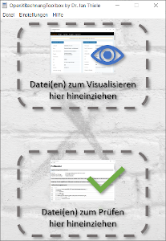
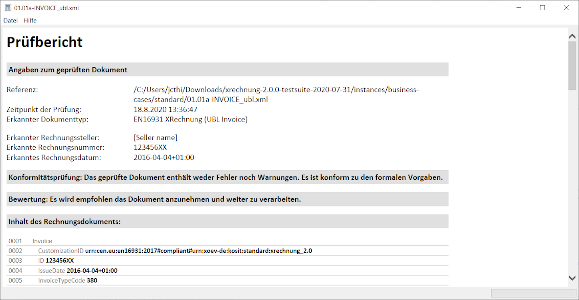
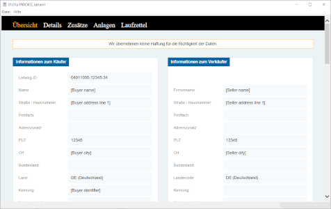
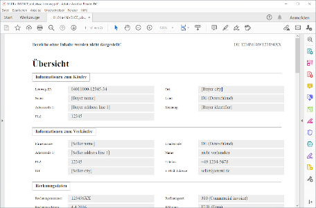
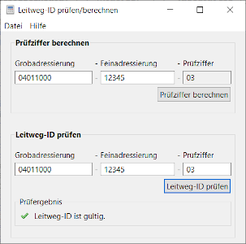
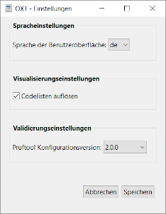

## OpenXRechnungToolbox
  
<div class="slideshow-container">
			<div class="mySlides fade">
			  <div class="numbertext">1 / 6</div>
			  
			  <div class="text">Hauptfenster</div>
			</div>
			<div class="mySlides fade">
			  <div class="numbertext">2 / 6</div>
			  
			  <div class="text">Prüfbericht</div>
			</div>
			<div class="mySlides fade">
			  <div class="numbertext">3 / 6</div>
			  
			  <div class="text">Visualisierung</div>
			</div>
			<div class="mySlides fade">
			  <div class="numbertext">4 / 6</div>
			  
			  <div class="text">PDF-Visualisierung</div>
			</div>
			<div class="mySlides fade">
			  <div class="numbertext">5 / 6</div>
			  
			  <div class="text">Leitweg-ID-Rechner/-Prüfer</div>
			</div>
			<div class="mySlides fade">
			  <div class="numbertext">6 / 6</div>
			  
			  <div class="text">Einstellungen</div>
			</div>
</div>
<br>

<div style="text-align:center">
  <span class="dot"></span> 
  <span class="dot"></span> 
  <span class="dot"></span> 
  <span class="dot"></span> 
  <span class="dot"></span> 
  <span class="dot"></span> 
</div>

<script>
var slideIndex = 0;
showSlides();

function showSlides() {
  var i;
  var slides = document.getElementsByClassName("mySlides");
  var dots = document.getElementsByClassName("dot");
  for (i = 0; i < slides.length; i++) {
    slides[i].style.display = "none";  
  }
  slideIndex++;
  if (slideIndex > slides.length) {slideIndex = 1}    
  for (i = 0; i < dots.length; i++) {
    dots[i].className = dots[i].className.replace(" active", "");
  }
  slides[slideIndex-1].style.display = "block";  
  dots[slideIndex-1].className += " active";
  setTimeout(showSlides, 2000); // Change image every 2 seconds
}
</script>

Die OpenXRechnungToolbox (OXT) bietet eine graphische Benutzeroberfläche zu den mit dem Standard XRechnung herausgegebenen Tools (Prüftool, Visualisierung) und fügt ergänzend noch ein paar weitere Funktionalitäten hinzu (Codelistenauflösung für die Visualisierung, Leitweg-ID-Rechner/-Prüfer, Nutzung für Peppol-Rechnungen). Damit macht sie die XRechnungs-Tools für Nicht-Programmierer nutzbar. 

### Funktionalitäten auf einen Blick

- **Erzeugung einer menschenlesbare Visualisierung** von XRechnungs-Dateien, inkl. optionaler Codelisten-Auflösung, inkl. Speicherfunktion als HTML-Datei sowie Erzeugung einer PDF-Visualiserung; auch für andere Rechnungsinstanzen nutzbar, die konform zur Europäischen Norm EN16931 sind (z.B. Peppol BIS 3.0)
- **Technische Validierung** von XRechnungs-Dateien sowie Peppol BIS 3.0 Rechnungen, verfügbar für verschiedene XRechnungs-Versionen, inkl. Speicherfunktion des Prüfberichts als HTML-Datei
- Berechnung und Prüfung von **Leitweg-ID-Prüfziffern**

### Vorteile gegenüber vielen anderen Angeboten

- **Sie geben Ihre Daten nicht aus der Hand**: kein Hochladen von Rechnungsdateien auf einen Server; reine lokale Desktop-Anwendung (Datenschutz)
- **Sie bleiben jederzeit anonym**: keine Registrierung oder sonstige Nutzer*inneninformationen erforderlich (Datenschutz)
- **Ihnen rückt kein Vertrieb auf den Leib**: kein kommerzielles Interesse
- **Sie besitzen vollständige digitale Souveränität**: offener Quellcode (Open Source), somit vollständige Nachvollziehbarkeit und Weiterentwicklungsmöglichkeit

### Wer steckt dahinter

Die OpenXRechnungToolbox wurde von Jan C. Thiele entwickelt. Dr. Dr. Jan C. Thiele ist hauptberuflich Referent und stv. Referatsleiter beim Senator für Finanzen der Freien Hansestadt Bremen. Er ist einer der Autoren des Standards XRechnung, hat das EU-Projekt "Peppol E-Invoicing für Government in Germany" (PeGGy) für Bremen durchgeführt und ist Vertreter Bremens im Steuerungskreis von XRechnung. 
Zuvor hat er als wissenschaftlicher Mitarbeiter der Universität Göttingen in verschiedenen Projekten (betriebliche) Informationssysteme, insb. Entscheidungsunterstützungssysteme im Umweltbereich, entworfen und entwickelt. Ein Schwerpunkt seiner wissenschaftlichen Tätigkeit war die simulationsbasierte Entscheidungsunterstützung. 
Die OpenXRechnungToolbox ist ein Freizeitprojekt und steht in keinem direkten Zusammenhang mit dem Senator für Finanzen. 
Als Open Source Software ist jede(r) eingeladen zur Weiterentwicklung der Software beizutragen. 

### Kontakt

Wenn Sie Kontakt aufnehmen wollen, Lob oder Optimierungshinweise mitteilen möchten, dann wenden Sie sich bitte mit Ihrem Anliegen an: openxrechnungtoolbox@gmx.net. 


You can use the [editor on GitHub](https://github.com/jcthiele/testRepo/edit/gh-pages/index.md) to maintain and preview the content for your website in Markdown files.

Whenever you commit to this repository, GitHub Pages will run [Jekyll](https://jekyllrb.com/) to rebuild the pages in your site, from the content in your Markdown files.

### Markdown

Markdown is a lightweight and easy-to-use syntax for styling your writing. It includes conventions for

```markdown
Syntax highlighted code block

# Header 1
## Header 2
### Header 3

- Bulleted
- List

1. Numbered
2. List

**Bold** and _Italic_ and `Code` text

[Link](url) and 
```

For more details see [GitHub Flavored Markdown](https://guides.github.com/features/mastering-markdown/).

### Jekyll Themes

Your Pages site will use the layout and styles from the Jekyll theme you have selected in your [repository settings](https://github.com/jcthiele/testRepo/settings). The name of this theme is saved in the Jekyll `_config.yml` configuration file.

### Support or Contact

Having trouble with Pages? Check out our [documentation](https://docs.github.com/categories/github-pages-basics/) or [contact support](https://github.com/contact) and we’ll help you sort it out.
